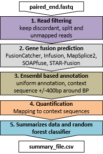

# EasyFuse 

[](https://github.com/TRON-Bioinformatics/EasyFuse/releases)
[](https://hub.docker.com/r/tronbioinformatics/easyfuse)
[](https://opensource.org/licenses/GPL-3.0)

EasyFuse is a pipeline to detect fusion transcripts from paired-end RNA-seq data with high accuracy.
The current version of EasyFuse uses three fusion gene detection tools, [STAR-Fusion](https://github.com/STAR-Fusion/STAR-Fusion/wiki), [Fusioncatcher](https://github.com/ndaniel/fusioncatcher) and [Arriba](https://arriba.readthedocs.io/en/latest/) along with a powerful read filtering strategy, stringent re-quantification of supporting reads and machine learning for highly accurate predictions.

Please note that previous versions of EasyFuse including the one in the EasyFuse publication utilized three additional prediction tools: [InFusion](https://bitbucket.org/kokonech/infusion/src/master/), [MapSplice2](http://www.netlab.uky.edu/p/bioinfo/MapSplice2) and [SoapFuse](https://sourceforge.net/p/soapfuse/wiki/Home/).
For maximal sensitivity, we recommend using an older EasyFuse release with five tools: [EasyFuse v1.3.7](https://github.com/TRON-Bioinformatics/EasyFuse/tree/v1.3.7)

<p align="center"></p>

 - Publication: [Weber D, Ibn-Salem J, Sorn P, et al. Nat Biotechnol. 2022](https://doi.org/10.1038/s41587-022-01247-9)


## Usage

### Dependencies

 - [NextFlow, 23.10.1](https://www.nextflow.io/)
 - [Conda](https://docs.anaconda.com/free/anaconda/install/index.html)

Please have a look at environment.yml.
The conda environment to run nextflow can be installed with the following command:
```
conda env create -f environment.yml --prefix conda_env/
```

### Download reference data

Before running EasyFuse the following reference annotation data needs to be downloaded (~104 GB).

```
# Download reference archive
wget ftp://easyfuse.tron-mainz.de/easyfuse_ref_v4.tar.gz

# Extract reference archive
tar xvfz easyfuse_ref_v4.tar.gz
```


### Install the nextflow pipeline

There are two alternatives, manually install the workflow or let Nexftlow handle this via the GitHub repository.

To install manually:
```
git clone https://github.com/TRON-Bioinformatics/EasyFuse.git
cd EasyFuse
# In order to use the nextflow.config from the repo we have to rename it and change the path to `conda.cacheDir`
mv nextflow.config.sample nextflow.config

# In order to run the test script you have to move the reference folder to test/easyfuse_ref/
mv ../easyfuse_ref_v4/ test/easyfuse_ref/
```

To install with Nextflow (only available from release 2.0.1 onwards):
```
nextflow run tron-bioinformatics/easyfuse -r x.y.z --help
```
where x.y.z corresponds to an EasyFuse release.


### Run the pipeline

Provide your downloaded reference data with the parameter `--reference`


Generate a tab-delimited input table with your matching FASTQs. The format of the table is: sample_name, fq1, fq2 (**without headers**).
E.g.:
```
sample_01	/path/to/sample_01_R1.fastq.gz	/path/to/sample_01_R2.fastq.gz
```


Start the pipeline as follows if you installed manually

```
nextflow main.nf \
  -profile conda -with-conda \
  --reference /path/to/reference/folder \
  --input_files /path/to/input_table_file \
  --output /path/to/output_folder
```


Or as follows if you installed it via Nextflow (only available from release 2.0.1 onwards):
```
nextflow run tron-bioinformatics/easyfuse -r x.y.z \
  -profile conda -with-conda \
  --reference /path/to/reference/folder \
  --input_files /path/to/input_table_file \
  --output /path/to/output_folder
```

### Output format

EasyFuse creates an output folder for each input sample containing the following files: 

 - `fusions.csv`
 - `fusions.pass.csv` 
 
Within the files, each line describes a candidate fusion transcript. The file `fusions.csv` contains all candidate fusions with annotated features, the prediction probability assigned by the EasyFuse model, and the corresponding prediction class (*positive* or *negative*). The file `fusions.pass.csv` contains only *positive* predicted gene fusions. 

#### Column description

Overview of all features/columns annotated by EasyFuse:

- **BPID:** The BPID (breakpoint ID) is an identifier composed of `chr1:position1:strand1_chr2:position2:strand2` and is used as the main identifier of fusion breakpoints throughout the EasyFuse publication. In the BPID, `chr` and `position` are 1-based genomic coordinates (GRCh38 reference) of the two breakpoint positions.
- **context_sequence_id:** The context sequence id is a unique identifier (hash value) calculated from `context_sequence`, the fusion transcript sequence context (400 upstream and 400 bp downstream from the breakpoint position).  
- **FTID:** The FTID is a unique identifier composed of `GeneName1_chr1:position1:strand1_transcript1_GeneName2_chr2:position2:strand2_transcript2`. All transcript combinations are considered.
- **Fusion_Gene:** Fusion Gene is a combination of the gene symbols of the involved genes in the form: `GeneName1_GeneName2`.  
- **Breakpoint1:** Breakpoint1 is a combination of the first breakpoint position in the form: `chr1:position1:strand1`.  
- **Breakpoint2:** Breakpoint2 is a combination of the second breakpoint position in the form: `chr2:position2:strand2`.
- **context_sequence_100_id:** The context sequence 100 id is a unique identifier (hash value) calculated from 200 bp context sequence (100 upstream and 100 bp downstream from the breakpoint).   
**type:** EasyFuse identifies six different types of fusion genes. The type describes the configuration of the involved genes to each other with respect to location on chromosomes and transcriptional strands:  
  - `cis_near`:  Genes on the same chromosome, same strand, order of genes matches reading direction, genomic distance < 1Mb (read-through likely)
  - `cis_far`: Genes on the same chromosome, same strand, order of genes matches reading direction, genomic distance  >= 1Mb 
  - `cis_trans`:  Genes on the same chromosome, same strand, but the order of genes does not match the reading direction
  - `cis_inv`:  Genes on the same chromosome but on different strands
  - `trans`:  Genes on different chromosomes, same strand
  - `trans_inv`:  Genes on different chromosomes, different strands

- **exon_nr:** Number of exons involved in the fusion transcript  
- **exon_starts:** Genomic starting positions of involved exons
- **exon_ends:** Genomic end positions of involved exons  
- **exon_boundary1:** Exon boundary of the breakpoint in Gene1 
    - `left_boundary` is 5' in strand orientation
    - `right_boundary` is 3' in strand orientation
    - `within` means breakpoint is inside exon)  
- **exon_boundary2:** Exon boundary of the breakpoint in Gene2 (`left_boundary` is 5' in strand orientation, `right_boundary` is 3' in strand orientation, `within` means breakpoint is inside exon)  
- **exon_boundary:** describes which of the partner genes (gene 1 + gene 2) has their breakpoint on an exon boundary:
  -  `both`:  `left_boundary`  + `right_boundary` 
  - `5prime`: `left_boundary` + `within` 
  -  `3prime`: `within` + `right_boundary`
  - `no_match`: `within` + `within`  

- **bp1_frame:** Reading frame of translated peptide at breakpoint for fusion transcript1 (-1 is non-coding region/no frame; 0,1,2 is coding region with indicated offset for reading frame)  
- **bp2_frame:** Reading frame of translated peptide at breakpoint for fusion transcript2 (-1 is none-coding region/no frame; 0,1,2 is coding region with indicated offset for reading frame)  
- **frame:** Type of frame for translation of fusion gene: 
  - `in_frame`: translation of wild type peptide sequences without frameshift after breakpoint (both coding frames are equal, `bp1_frame` == `bp2_frame` != `-1`)
  - `neo_frame`:  translation of none-coding region after breakpoint leads to novel peptide sequence (`bp1_frame` is 0, 1, or 2 and `bp2_frame` is -1) 
  - `no_frame`: no translation (`bp1_frame` is -1)
  - `out_frame`: out of frame translation after breakpoints leads to novel peptide sequence (`bp1_frame` != `bp2_frame` != -1)
- **context_sequence:** The fusion transcript sequence downstream and upstream from the breakpoint (default 800 bp, shorter if transcript start or end occurs within the region)  
- **context_sequence_bp:** Position of breakpoint in context sequence  
- **neo_peptide_sequence:** Translated peptide sequence of context sequence starting at 13 aa before breakpoint until 13 aa after breakpoint (for in-frame transcripts) or until next stop codon (for out frame and neo frame). This is to consider only the region around the breakpoint that may contain neo-epitopes.
- **neo_peptide_sequence_bp:** Breakpoint on translated peptide sequence.  
- ***toolname*_detected:** 1 if breakpoint was detected by respective tool, 0 if not
- ***toolname*_junc:** Junction read count (reads covering breakpoint) reported by *toolname*  
- ***toolname*_span:** Spanning read count (read pairs with each partner on one side of breakpoint) reported by *toolname*  
- **tool_frac:** Fraction of tools detecting the fusion gene breakpoint
- ***category*_bp:** Location of breakpoint on context sequence (400 for an 800 bp context sequence). Whereby *category* describes (here and in the following columns) the reference sequence to which the reads were mapped and quantified: 
  - `ft`: context_sequence of fusion transcript 
  - `wt1`: corresponding sequence of fusion partner 1 (wild type 1)
  - `wt2`: corresponding sequence of fusion partner 2 (wild type 2)
- ***category*_junc:** Fraction of read counts from 1 million reads that map to sequence and overlap breakpoint by at least 10 bp  
- ***category*_span:** Fraction of read pairs from 1 million sequenced read pairs, that map to both sides of breakpoint position
- ***category*_anch:** Maximal read anchor size across all junction reads, where the anchor size for a given read is defined as the minimum distance between read start and breakpoint or read end and the breakpoint.  
- ***category*_junc_cnt:** Number of reads that map to sequence and overlap breakpoint by at least 10 bp  
- ***category*_span_cnt:** Number of read pairs, that map to both sides of breakpoint position  
- ***category*_anch_cnt:** Maximal read anchor size across all junction reads, where the anchor size for a given read is defined as the minimum distance between read start and breakpoint or read end and the breakpoint.  

- **prediction_prob:** The predicted probability according to the machine learning model that the fusion candidate is a true positive. 
- **prediction_class:** The predicted class (`negative` or `positive`) according to the machine learning model. This classification relies on a user-defined threshold (default 0.5) applied to the `precition_prob` column. 


## Run EasyFuse 1.3.7

For maximial sensitivity, we currently recommend using [EasyFuse version 1.3.7](https://github.com/TRON-Bioinformatics/EasyFuse/tree/v1.3.7) via Docker or Singularity.

### Run via Docker

The Docker image can be downloaded from [dockerhub](https://hub.docker.com/r/tronbioinformatics/easyfuse) using the following command:

```
docker pull tronbioinformatics/easyfuse:latest
```

EasyFuse will require three folders:

* The input data folder containing FASTQ files, in this example `/path/to/data`.
* The reference data folder, in this example `/path/to/easyfuse_ref`
* The output folder, in this example `/path/to/output`

EasyFuse can be started by mapping the input data, references, and output folders.

```
docker run \
  --name easyfuse_container \
  -v /path/to/easyfuse_ref:/ref \
  -v /path/to/data:/data \
  -v /path/to/output:/output \
  --rm \
  -it easyfuse:latest \
  python /code/easyfuse/processing.py -i /data -o /output

```

### Run EasyFuse with Singularity

Alternatively, EasyFuse can be executed with [Singularity](https://sylabs.io/docs/) as follows:

```
singularity exec 
  --containall \
  --bind /path/to/easyfuse_ref:/ref \
  --bind /path/to/data:/data \
  --bind /path/to/output:/output \  
  docker://tronbioinformatics/easyfuse:latest \
  python /code/easyfuse/processing.py -i /data/ -o /output

```

The output can be found in `/path/to/output/FusionSummary`.


## Citation

If you use EasyFuse, please cite:  [Weber D, Ibn-Salem J, Sorn P, et al. Nat Biotechnol. 2022](https://doi.org/10.1038/s41587-022-01247-9)

