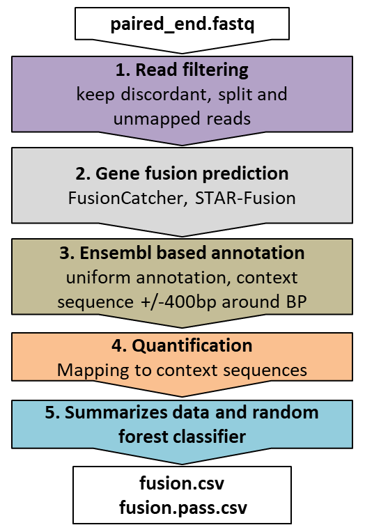

# EasyFuse
[](https://doi.org/10.1038/s41587-022-01247-9)

[](https://github.com/TRON-Bioinformatics/easyfuse/actions/workflows/nf-test.yml)

[](https://github.com/TRON-Bioinformatics/easyfuse/actions/workflows/linting.yml)
[](https://www.nextflow.io/)
[](https://github.com/nf-core/tools/releases/tag/3.4.1)

[](https://docs.conda.io/en/latest/)
[](https://sylabs.io/docs/)
[](https://docs.conda.io/)
[](https://www.docker.com/)
[](https://opensource.org/licenses/GPL-3.0)

## Introduction

EasyFuse is a pipeline to detect fusion transcripts from paired-end RNA-seq data with high accuracy.
The current version of EasyFuse uses three fusion gene detection tools, [STAR-Fusion](https://github.com/STAR-Fusion/STAR-Fusion/wiki), [Fusioncatcher](https://github.com/ndaniel/fusioncatcher) and [Arriba](https://arriba.readthedocs.io/en/latest/) along with a powerful read filtering strategy, stringent re-quantification of supporting reads and machine learning for highly accurate predictions.

<p align="center"></p>

- Publication: [Weber D, Ibn-Salem J, Sorn P, et al. Nat Biotechnol. 2022](https://doi.org/10.1038/s41587-022-01247-9)

## Dependencies

- [NextFlow, 24.10.1](https://www.nextflow.io/)

Depending upon the profile the user selects the pipeline can be run with either of the following
- [Conda](https://docs.anaconda.com/free/anaconda/install/index.html) or
- [Singularity](https://docs.sylabs.io/guides/3.5/user-guide/introduction.html) or
- [Docker](https://www.docker.com/)

## Download reference data

Before running EasyFuse the following reference annotation data needs to be downloaded (~104 GB).

```bash
# Download reference archive
wget ftp://easyfuse.tron-mainz.de/easyfuse_ref_v4.tar.gz

# Extract reference archive
tar xvfz easyfuse_ref_v4.tar.gz
```

## Install the nextflow pipeline

There are two alternatives, manually install the workflow or let Nexftlow handle this via the GitHub repository.

To install manually:

```
git clone https://github.com/TRON-Bioinformatics/EasyFuse.git
cd EasyFuse
```

To install with Nextflow (only available from release 2.0.1 onwards):

```bash
nextflow run tron-bioinformatics/easyfuse -r x.y.z --help
```

where x.y.z corresponds to an EasyFuse release.

## Run the pipeline

Provide your downloaded reference data with the parameter `--reference`

Generate a tab-delimited input table with your matching FASTQs. The format of the table is: `sample`, `fastq_1`, `fastq_2` (**with headers**).
E.g.:

```tsv
sample  fastq_1  fastq_2
sample_01	/path/to/sample_01_R1.fastq.gz	/path/to/sample_01_R2.fastq.gz
sample_02	/path/to/sample_02_R1.fastq.gz	/path/to/sample_02_R2.fastq.gz
```

Start the pipeline

```bash
nextflow run main.nf \
  -profile conda \
  --input /path/to/input_table_file \
  --output /path/to/output_folder \
  --reference /path/to/reference/folder
```

Or as follows if you installed it via Nextflow (only available from release 2.0.1 onwards):

```bash
nextflow run tron-bioinformatics/easyfuse -r x.y.z \
  -profile conda \
  --input_files /path/to/input_table_file \
  --output /path/to/output_folder \
  --reference /path/to/reference/folder
```

If you want to run the pipeline on cluster

```bash
nextflow run tron-bioinformatics/easyfuse -r x.y.z \
  -profile conda,slurm \
  --input_files /path/to/input_table_file \
  --output /path/to/output_folder \
  --reference /path/to/reference/folder
```

The pipeline supports the following profiles:

- Conda - nextflow builds a dedicated conda environment for each of the processes to run
- Singularity - nextflow pulls dedicated singularity containers for the processes to run. If containers are available locally, set the `NXF_SINGULARITY_CACHEDIR=/path/to/local/images` environment variable for nextflow to find the images locally.
- Slurm - the slurm profile would run the pipeline with the slurm executor, parallelizing the nextflow processes.

Note: If you want to use a custom profile (e.g. for running jobs on a cluster), please refer to https://www.nextflow.io/docs/latest/config.html for further information.

> [!TIP]<br>
> Please provide pipeline parameters via the CLI or Nextflow `-params-file` option. Custom config files including those provided by the `-c` Nextflow option can be used to provide any configuration _**except for parameters**_; see [docs](https://nf-co.re/docs/usage/getting_started/configuration#custom-configuration-files).

## Output format

EasyFuse creates an output folder for each input sample containing the following files:

- `fusions.csv`
- `fusions.pass.csv`

Within the files, each line describes a candidate fusion transcript. The file `fusions.csv` contains all candidate fusions with annotated features, the prediction probability assigned by the EasyFuse model, and the corresponding prediction class (_positive_ or _negative_). The file `fusions.pass.csv` contains only _positive_ predicted gene fusions.

## Using EasyFuse with Mouse (Mus Musculus) Data
EasyFuse now supports fusion detection with **Mouse** data.

### Download reference data
```bash
# Download reference archive
wget ftp://easyfuse.tron-mainz.de/easyfuse2_mouse_ref_v1.tar.gz

# Extract reference archive
tar xvfz easyfuse2_mouse_ref_v1.tar.gz
```

The samplesheet specification for running Easyfuse in this case remains the same. The following command shows the correct parameter combination

```bash
nextflow run tron-bioinformatics/easyfuse -r x.y.z \
  -profile conda,slurm \
  --input_files /path/to/input_table_file \
  --output /path/to/output_folder \
  --reference /path/to/reference/folder \
  --fusion_tools arriba,starfusion \
   --model_pred EF_requant_type
```
> [!NOTE]<br>
> For **Mouse (Mus Musculus)** samples, only `arriba` and `starfusion` are supported and **NOT** `fusioncatcher`.
<br>

## Column description

### Overview of all features/columns annotated by EasyFuse:

- **BPID:** The BPID (breakpoint ID) is an identifier composed of `chr1:position1:strand1_chr2:position2:strand2` and is used as the main identifier of fusion breakpoints throughout the EasyFuse publication. In the BPID, `chr` and `position` are 1-based genomic coordinates (GRCh38 reference) of the two breakpoint positions.
- **context_sequence_id:** The context sequence id is a unique identifier (hash value) calculated from `context_sequence`, the fusion transcript sequence context (400 upstream and 400 bp downstream from the breakpoint position).
- **FTID:** The FTID is a unique identifier composed of `GeneName1_chr1:position1:strand1_transcript1_GeneName2_chr2:position2:strand2_transcript2`. All transcript combinations are considered.
- **Fusion_Gene:** Fusion Gene is a combination of the gene symbols of the involved genes in the form: `GeneName1_GeneName2`.
- **Breakpoint1:** Breakpoint1 is a combination of the first breakpoint position in the form: `chr1:position1:strand1`.
- **Breakpoint2:** Breakpoint2 is a combination of the second breakpoint position in the form: `chr2:position2:strand2`.
- **context_sequence_100_id:** The context sequence 100 id is a unique identifier (hash value) calculated from 200 bp context sequence (100 upstream and 100 bp downstream from the breakpoint).  
  **type:** EasyFuse identifies six different types of fusion genes. The type describes the configuration of the involved genes to each other with respect to location on chromosomes and transcriptional strands:
  - `cis_near`: Genes on the same chromosome, same strand, order of genes matches reading direction, genomic distance < 1Mb (read-through likely)
  - `cis_far`: Genes on the same chromosome, same strand, order of genes matches reading direction, genomic distance >= 1Mb
  - `cis_trans`: Genes on the same chromosome, same strand, but the order of genes does not match the reading direction
  - `cis_inv`: Genes on the same chromosome but on different strands
  - `trans`: Genes on different chromosomes, same strand
  - `trans_inv`: Genes on different chromosomes, different strands

- **exon_nr:** Number of exons involved in the fusion transcript
- **ft1_exon_nr:** Exon number of fusion partner 1 that is invoved in building the transcript breakpoint
- **ft2_exon_nr:** Exon number of fusion partner 2 that is invoved in building the transcript breakpoint
- **exon_starts:** Genomic starting positions of involved exons
- **exon_ends:** Genomic end positions of involved exons
- **exon_boundary1:** Exon boundary of the breakpoint in Gene1
  - `left_boundary` is 5' in strand orientation
  - `right_boundary` is 3' in strand orientation
  - `within` means breakpoint is inside exon)
- **exon_boundary2:** Exon boundary of the breakpoint in Gene2 (`left_boundary` is 5' in strand orientation, `right_boundary` is 3' in strand orientation, `within` means breakpoint is inside exon)
- **exon_boundary:** describes which of the partner genes (gene 1 + gene 2) has their breakpoint on an exon boundary:
  - `both`: `left_boundary` + `right_boundary`
  - `5prime`: `left_boundary` + `within`
  - `3prime`: `within` + `right_boundary`
  - `no_match`: `within` + `within`

- **bp1_frame:** Reading frame of translated peptide at breakpoint for fusion transcript1 (-1 is non-coding region/no frame; 0,1,2 is coding region with indicated offset for reading frame)
- **bp2_frame:** Reading frame of translated peptide at breakpoint for fusion transcript2 (-1 is none-coding region/no frame; 0,1,2 is coding region with indicated offset for reading frame)
- **frame:** Type of frame for translation of fusion gene:
  - `in_frame`: translation of wild type peptide sequences without frameshift after breakpoint (both coding frames are equal, `bp1_frame` == `bp2_frame` != `-1`)
  - `neo_frame`: translation of none-coding region after breakpoint leads to novel peptide sequence (`bp1_frame` is 0, 1, or 2 and `bp2_frame` is -1)
  - `no_frame`: no translation (`bp1_frame` is -1)
  - `out_frame`: out of frame translation after breakpoints leads to novel peptide sequence (`bp1_frame` != `bp2_frame` != -1)
- **context_sequence:** The fusion transcript sequence downstream and upstream from the breakpoint (default 800 bp, shorter if transcript start or end occurs within the region)
- **context_sequence_bp:** Position of breakpoint in context sequence
- **neo_peptide_sequence:** Translated peptide sequence of context sequence starting at 13 aa before breakpoint until 13 aa after breakpoint (for in-frame transcripts) or until next stop codon (for out frame and neo frame). This is to consider only the region around the breakpoint that may contain neo-epitopes.
- **neo_peptide_sequence_bp:** Breakpoint on translated peptide sequence.
- **fusion_protein_sequence:** Full-length protein sequence
- **fusion_protein_sequence_bp:** Position of breakpoint in full-length protein seqeunce
- **_toolname_\_detected:** 1 if breakpoint was detected by respective tool, 0 if not
- **_toolname_\_junc:** Junction read count (reads covering breakpoint) reported by _toolname_
- **_toolname_\_span:** Spanning read count (read pairs with each partner on one side of breakpoint) reported by _toolname_
- **tool_frac:** Fraction of tools detecting the fusion gene breakpoint
- **_category_\_bp:** Location of breakpoint on context sequence (400 for an 800 bp context sequence). Whereby _category_ describes (here and in the following columns) the reference sequence to which the reads were mapped and quantified:
  - `ft`: context_sequence of fusion transcript
  - `wt1`: corresponding sequence of fusion partner 1 (wild type 1)
  - `wt2`: corresponding sequence of fusion partner 2 (wild type 2)
- **_category_\_junc:** Fraction of read counts from 1 million reads that map to sequence and overlap breakpoint by at least 10 bp
- **_category_\_span:** Fraction of read pairs from 1 million sequenced read pairs, that map to both sides of breakpoint position
- **_category_\_anch:** Maximal read anchor size across all junction reads, where the anchor size for a given read is defined as the minimum distance between read start and breakpoint or read end and the breakpoint.
- **_category_\_junc_cnt:** Number of reads that map to sequence and overlap breakpoint by at least 10 bp
- **_category_\_span_cnt:** Number of read pairs, that map to both sides of breakpoint position
- **_category_\_anch_cnt:** Maximal read anchor size across all junction reads, where the anchor size for a given read is defined as the minimum distance between read start and breakpoint or read end and the breakpoint.

- **prediction_prob:** The predicted probability according to the machine learning model that the fusion candidate is a true positive.
- **prediction_class:** The predicted class (`negative` or `positive`) according to the machine learning model. This classification relies on a user-defined threshold (default 0.5) applied to the `precition_prob` column.

## Citations

If you use EasyFuse, please cite: [Weber D, Ibn-Salem J, Sorn P, et al. Nat Biotechnol. 2022](https://doi.org/10.1038/s41587-022-01247-9)
